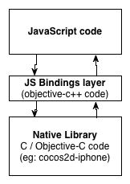
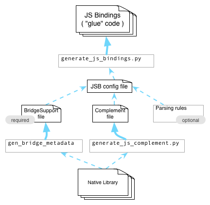
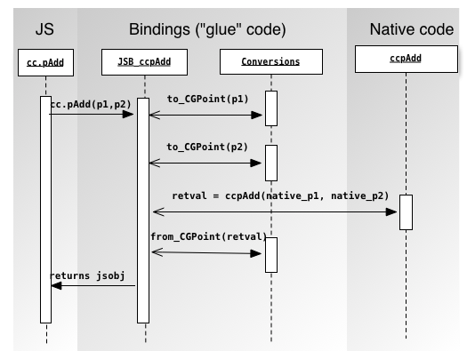
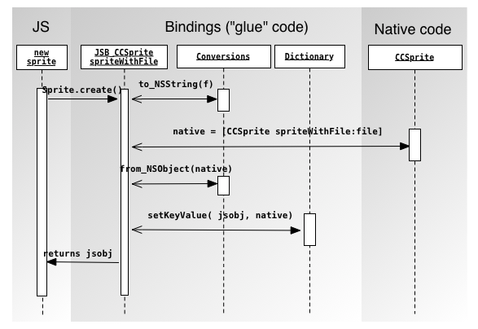
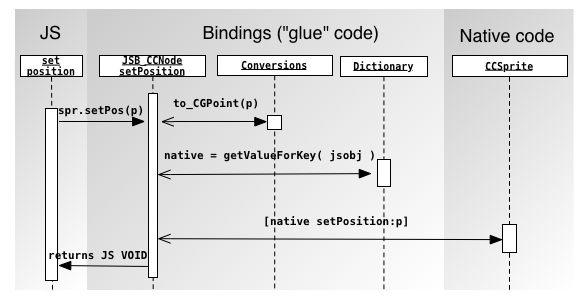

# JavaScript Bindings for C and Objective-C

## Introduction

JavaScript Bindings for C / Objective-C (JSB) is the "glue" code (or wrapper code) that sits between native code (C or Objective-C) and JavaScript (JS) code.
JSB allows calling native code from JS and vice-versa.

That means that you can interact with your favorite native library from JS. As an example, you could create a [cocos2d](http://www.cocos2d-iphone.org) particle system in JS, while its logic and rendering will be executed natively. Or you could create a [Chipmunk Physics](http://www.chipmunk-physics.net) world in JS, while the whole physics simulation, including the collisions detections, would run natively.

The JS code is interpreted by [SpiderMonkey](https://developer.mozilla.org/en-US/docs/SpiderMonkey), Mozilla's JS virtual machine (VM).
It uses the latest stable version of SpiderMonkey (as of this writing it is v14.0.1). The JS VM is extended by JSB to support custom types, custom structures and Objective-C objects.

JSB has a flexible set of rules that could be used to select the classes, methods, functions and structs to parse or ignore; which methods are callbacks; renaming rules, among some of its features. And to ease the creation of these rules, it supports regular expressions.

## Major features

Highlights of JSB:

- Supports any Objective-C / C library
- Automatically generates the JS bindings ("glue" code)
- No need to modify the source code of your libraries
- Powerful set of rules to customize the generated JS API
- Automatically converts JS types into Objective-C objects and vice-versa:
- Automatically converts native classes and structs into JS objects
- Supports "subclassing" native objects in JS
- Supports callbacks

## How the code is generated

JSB comes with a python script called `generate_js_bindings.py` that generates the glue code. It needs a configuration file that contains the parsing rules and the [BridgeSupport](http://developer.apple.com/library/mac/#documentation/Darwin/Reference/ManPages/man5/BridgeSupport.5.html) files.

BridgeSupport files are generated by a script called [`gen_bridge_metada`](http://developer.apple.com/library/mac/#documentation/Darwin/Reference/ManPages/man1/gen_bridge_metadata.1.html#//apple_ref/doc/man/1/gen_bridge_metadata) that is part of OS X, and generates xml files with information like class names, method names, arguments, return values, internals of the structs, constants, etc. 

`gen_bridge_metada`, internally, uses [`clang`](http://clang.llvm.org/) to parse the native code. The output is very reliable, but unfortunately, it is not complete: class hierarchy, protocols and properties data are missing. That's why JSB comes with another python script, called `generate_js_complement.py`, that generates the missing information.

Once we have the configuration file setup, we can run the `generate_js_bindings.py` script to generate the glue code.

To summarize, the structure of a JSB configuration file is:

- Parsing rules (optional): renaming rules, classes to ignore / parse, etc...
- BridgeSupport files (required): Class, methods, functions, structs information
- Complement files (required for Objective-C projects): Hierarchy, protocol and properties information

## Internals of the JS bindings ("glue" code)

The JS bindings code allows to call JS code from native and vice-versa. It forwards native callbacks to JS, and JS calls to native. Let's see them in detail:

### Calling native functions from JS

The following code will call the the native C function `ccpAdd()`:

	var p1 = cc.p(0,0);
	var p2 = cc.p(1,1);
	// cc.pAdd is a "wrapped" function, and it will call the cocos2d ccpAdd() C function
	var ret = cc.pAdd(p1, p2); 

Let's take a look at the native declaration of `ccpAdd`:

	CGPoint ccpAdd(const CGPoint v1, const CGPoint v2);

So when `cc.pAdd` is executed, it will call the "glue" function code `JSB_ccpAdd`. And `JSB_ccpAdd` does:

- converts the arguments from JS to native
- calls the native `ccpAdd()` function
- converts the return value from native to JS
- it fails if there are errors converting either the arguments or the return value.

### Calling native instance / class methods from JS

It is also possible to call instance or class methods from JS. The internal logic is similar to calling native functions. Let's have look:

	// Creates a sprite and sets its position to 200,200
	var sprite = cc.Sprite.create('image.png');
	sprite.setPosition( cc.p(200,200) );

`cc.Sprite.create("image.png")` will call the "glue" function `JSB_CCSprite_spriteWithFile_rect__static`, which does:

- converts the JS String into a native string
- creates a native instance of `CCSprite` by calling `[CCSprite spriteWithFile:@"image.png"]`
- converts the native instance into a JS Object
- Adds the newly created instance into a dictionary using the JS object as `key`
- returns the converted instance to JS.

And `sprite.setPosition(cc.p(200,200))` will call the "glue" function `JSB_CCNode_setPosition_`, which does:

- Obtains the native instance from the dictionary. The JS Object is used as `key`.
- Converts the point JS object to `CGPoint`
- calls `[instance setPosition:p]`
- Since `setPosition:` has no return value, it returns a "void" object to JS

### Calling JS code from native

In order to call JS code from native, the only thing that you need to do is:

	// JSBCore is responsible registering the native objects in JS, among other things
	[[JSBCore sharedInstance] runScript:@"my_js_script.js"];

## Configuration file

The configuration has a set of powerful rules that could transform the native API into a customized JS API.
As an example, the default JS API for:

	// CCAnimation (from cocos2d-iphone v2.0)
	+(id) animationWithAnimationFrames:(NSArray*)arrayOfAnimationFrames delayPerUnit:(float)delayPerUnit loops:(NSUInteger)loops;

will be:

	// ugly
	cc.CCAnimation.animationWithAnimationFrames_delayPerUnit_loops_( frames, delay, loops );

So, with a simple set of rules, we can transform that JS API into this:

	// more JS friendly
	cc.Animation.create( frames, delay, loops );

First, we need to remove the `CC` prefix from the class name, since it belongs to the `cc` namespace.

	# Part of cocos2d_jsb.ini configuration file
	obj_class_prefix_to_remove = CC

And finally we add a rename rule for that method. 

	# Part of cocos2d_jsb.ini configuration file
	method_properties =  CCAnimation # animationWithAnimationFrames:delayPerUnit:loops: =  name:"create",

But what happens with the other constructors of animation ?

	// CCAnimation supports 4 different constructors
	+(id) animation; //
	+(id) animationWithSpriteFrames:(NSArray*)arrayOfSpriteFrameNames;
	+(id) animationWithSpriteFrames:(NSArray*)arrayOfSpriteFrameNames delay:(float)delay;
	+(id) animationWithAnimationFrames:(NSArray*)arrayOfAnimationFrames delayPerUnit:(float)delayPerUnit loops:(NSUInteger)loops;

What we should do, is to create a rule that merges the 4 constructors into one. JSB will call the correct one depending on the number of arguments. This how the rule should look:

	# Part of cocos2d_jsb.ini configuration file
	method_properties =  CCAnimation # animationWithAnimationFrames:delayPerUnit:loops: =  name:"create"; merge: "animation" | "animationWithSpriteFrames:" | "animationWithSpriteFrames:delay:",

And the code in JS will look like:

	// calls [CCAnimation animation]
	var anim = cc.Animation.create(); 

	// calls [CCAnimation animnationWithSpriteFrames:]
	var anim = cc.Animation.create(array);

	// calls [CCAnimation animnationWithSpriteFrames:delay:]
	var anim = cc.Animation.create(array, delay);

	// calls [CCAnimation animationWithAnimationFrames:delayPerUnit:loops:]
	var anim = cc.Animation.create(array, delay, loops);

## Who is using this ? Show me real examples

JSB has been used to generate bindings for the following projects:

- [cocos2d-iphone v2.1] (https://github.com/cocos2d/cocos2d-iphone/tree/develop-v2) (develop-v2 branch)
- CocosDenshion
- CocosBuilder Reader
- [Chipmunk 6.1.1] (https://github.com/slembcke/Chipmunk-Physics)

cocos2d-iphone v2.1 comes with 3 demo projects that uses it: 

- JS Tests: cocos2d JS bindings tests
- JS Watermelon With Me: a simple physics game that uses JS bindings for cocos2d, Chipmunk, CocosDenshion and CocosBuilder Reader.
- JS MoonWarriors: A top-down shooter that uses JS bindings for cocos2d

It is noteworthy that thanks to the powerful set of rules, the JS API generated for cocos2d-iphone is the same one as cocos2d-html5 API. In fact, the JavaScript game (MoonWarriors) [https://github.com/ricardoquesada/MoonWarriors] runs on top of cocos2d-iphone + JSB and cocos2d-html5 without changing a single line of code. Try the Web version: [MoonWarriors] (http://www.cocos2d-iphone.org/downloads/MoonWarriors/)

## Download

Interested in project ? You can download it form here: [http://github.com/ricardoquesada/jsbindings](http://github.com/ricardoquesada/jsbindings)

Or simple do:

	$ git clone git://github.com/ricardoquesada/jsbindings.git

Let us know if you generate JS bindings for any project!

## Info about the scripts

The `gen_bridge_metada` file that is bundled with OS X 10.6 (or older) should be avoided. It is recommended to generate the BridgeSupport files in OS X 10.8 (Mountain Lion).

Quick

    $ cd jsbindings/src/auto
    $ ../../generate_js_bindings.py -c ../../configs/cocos2d/cocos2d_jsb.ini 
    $ ../../generate_js_bindings.py -c ../../configs/chipmunk/chipmunk_jsb.ini 
    $ ../../generate_js_bindings.py -c ../../configs/CocosBuilderReader/CocosBuilderReader_jsb.ini 
    $ ../../generate_js_bindings.py -c ../../configs/CocosDenshion/CocosDenshion_jsb.ini 

## Bugs / Limitations

As of this writing, these are the current bugs and/or limitations. For an updated list of bugs/limitations, please visit the project's homepage.

- No JS debugger. Remote debugging capabilities will be added once SpiderMonkey 15 is released.
- No JS profiler.
- Native object controls the life of JS object
	- It means that native objects might get released while their JS counterpart is still live
	- This logic is flawed since a JS object might point to an already released native object under certain situations.
	- The solution is that the JS objects should control the life of the native object. Fix in progress
	